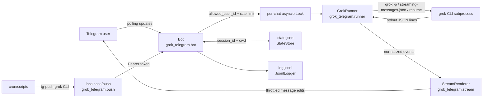

# grok-telegram

Telegram bridge to the `grok` (Grok Build) CLI. Talk to Grok from your phone with full skill/MCP parity. Bonus: a localhost push endpoint so cron jobs can DM you.

Sibling of [claude-telegram](https://github.com/NickBell123/claude-telegram) — same architecture, different CLI.

## 30-second overview

`grok-telegram` is a small Python service for a single operator. It polls Telegram, accepts messages only from one configured user ID, runs the real `grok` CLI as a subprocess, and streams Grok's `streaming-messages-json` output back by editing Telegram messages in place. It also exposes a bearer-protected localhost `/push` endpoint so scripts and cron jobs can send Telegram notifications through the same bot.

The bridge deliberately wraps the installed CLI instead of reimplementing Grok Build behavior. That keeps the runtime close to an interactive `grok` session: the same binary, local config, skills, MCP servers, and working directory semantics are used.

**Rich text:** replies stream as plain text, then the finished message is converted to Telegram **HTML** (bold, italic, `code`, pre blocks, links, lists, tool blockquotes). If markup is rejected, the bot falls back to plain text.

## Architecture



## Claude vs Grok mapping

| Concern | claude-telegram | grok-telegram |
|---------|-----------------|---------------|
| CLI | `claude -p … --output-format stream-json --dangerously-skip-permissions` | `grok -p … --output-format streaming-messages-json --always-approve` |
| Resume | `--resume <id>` | `--resume <id>` |
| State dir | `~/.claude-telegram` | `~/.grok-telegram` |
| Push port | `8787` | `8788` |
| Push CLI | `tg-push` | `tg-push-grok` |
| systemd | `claude-telegram.service` | `grok-telegram.service` |

**Important:** create a **separate** BotFather bot. Two long-pollers cannot share one token. You can run both bridges side by side.

## Requirements

- Linux with a systemd user session (`systemctl --user`)
- Python 3.12+
- The [`grok` CLI](https://x.ai) (Grok Build), installed and authenticated

## Install

```bash
cd ~/grok-telegram
./scripts/install.sh
```

You'll be prompted for:
- **Telegram bot token** — create one via [@BotFather](https://t.me/BotFather) (new bot, not the Claude one).
- **Your Telegram user ID** — DM [@userinfobot](https://t.me/userinfobot) to get it.

The installer writes `~/.grok-telegram/env`, installs `tg-push-grok` to `~/.local/bin/`, enables a user systemd service, and starts it.

## Commands

- `/help` — list commands
- `/reset` — clear the conversation, start fresh
- `/cd <path>` — change Grok's working directory for this chat
- `/cwd` — show current working directory
- `/cost` — show cost of the last turn
- `/stop` — interrupt the in-flight turn
- `/photo <path>` — send a local image as a Telegram photo
- `/file <path>` — send a local file as a Telegram document
- `/tts [on|off|auto]` — voice reply mode (default **auto**)
- `/speech grok|local|default` — STT/TTS engine (alias: `/provider`)
- `/model [id|default]` — show or pin the Grok model (`GROK_MODEL`, default **grok-4.6**)
- `/say <text>` — speak text without running Grok (alias: `/voice`)

Paths are relative to the chat's cwd unless absolute.

**Auto-attach** (after a normal turn): images only (`.png`, `.jpg`, …) discovered in tool results or assistant text. Identical copies (e.g. session folder + Desktop) are deduped by content hash. Terminal logs, `.log` files, secrets (`.env`, keys, tokens) are skipped. Use `/file` for non-image documents. Photos ≤10 MB; documents via `/file` ≤50 MB.

## Speech (STT / TTS)

**Default provider: Grok Voice APIs** (same SuperGrok / X Premium+ OAuth as the CLI — token from `~/.grok/auth.json`). No separate API key required unless you prefer `XAI_API_KEY`.

| Direction | Grok (default) | Local fallback (`SPEECH_PROVIDER=local`) |
|-----------|----------------|------------------------------------------|
| **STT** | `POST https://api.x.ai/v1/stt` | Whisper CLI |
| **TTS** | `POST https://api.x.ai/v1/tts` → ffmpeg OGG | edge-tts → ffmpeg OGG |

**Modes (`/tts`):** `auto` speak when you send voice (default) · `on` always speak · `off` text only.

Default Grok voice: `ara` (set `TTS_VOICE` / `GROK_TTS_VOICE` to any id from `GET /v1/tts/voices`, e.g. `eve`, `rex`, `leo`).

**Speed:** Grok TTS latency scales with text length (~few seconds per hundred characters). Auto-replies speak only the **first ~280 characters** (sentence-aware); the full text still appears in the chat. Raise with `SPEECH_MAX_CHARS`. `/say` allows up to 1200 chars.

```
GROK_MODEL=grok-4.6
SPEECH_PROVIDER=grok
STT_ENABLED=true
TTS_ENABLED=true
TTS_VOICE=ara
SPEECH_MAX_CHARS=280
GROK_AUTH_PATH=~/.grok/auth.json
# optional pay-as-you-go override instead of OAuth:
# XAI_API_KEY=...
FFMPEG_BIN=/usr/bin/ffmpeg
# local fallback only:
# SPEECH_PROVIDER=local
# WHISPER_BIN=/usr/local/bin/whisper
# EDGE_TTS_BIN=edge-tts
```

## Pushing from cron

```bash
echo "BTC +2.1%" | tg-push-grok
tg-push-grok --title "Morning brief" --file /tmp/brief.md
```

`examples/morning-brief.sh` is a worked example: a cron job that runs `grok -p` headless and delivers the result to Telegram.

## Files

- `~/.grok-telegram/env` — config (chmod 600)
- `~/.grok-telegram/state.json` — per-chat session IDs and cwd
- `~/.grok-telegram/log.jsonl` — append-only event log

## Logs

```bash
journalctl --user -u grok-telegram -f
tail -f ~/.grok-telegram/log.jsonl
```

## Development

```bash
python3 -m venv .venv
.venv/bin/pip install -r requirements-dev.txt
.venv/bin/pytest
```

## Safety

- Only the configured `ALLOWED_USER_ID` can talk to the bot. Other users are dropped silently.
- The push endpoint binds to `127.0.0.1` only and requires a bearer token.
- `grok` runs with `--always-approve`. Same blast radius as you running Grok Build interactively. If your phone is lost, revoke the bot token via @BotFather.
- Built for a single operator. One `grok` subprocess runs at a time per chat; `/stop` targets the in-flight turn.

## License

MIT — see [LICENSE](LICENSE).
